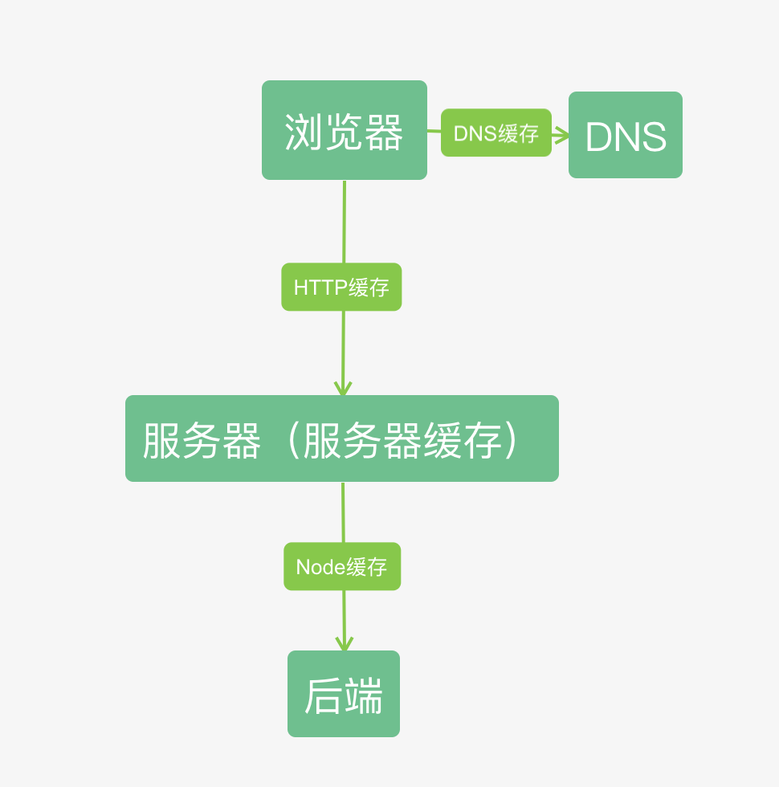

[TOC]

# 缓存


  
# DNS缓存

为了方便记忆，网站都是注册了一个域名，通过域名来访问网站。访问网站内容，实际是通过访问IP地址实现的，所以在域名和IP之前存在一种对应关系，而域名解析服务器即DNS服务器则完成将域名翻译成IP地址的任务。

为了增加访问效率，计算机有域名缓存机制，当访问过某个网站并得到其IP后，会将其域名和IP缓存下来，下一次访问的时候，就不需要再请求域名服务器获取IP，直接使用缓存中的IP，提高了响应的速度。当然缓存是有有效时间的，当过了有效时间后，再次请求网站，还是需要先请求域名解析。

但是域名缓存机制也可能会带来麻烦。例如IP已变化了，仍然使用缓存中的IP来访问，将会访问失败。再如 同一个域名在内网和外网访问时所对应的IP是不同的，如在外网访问时通过外网IP映射到内网的IP。同一台电脑在外网环境下访问了此域名，再换到内网来访问此域名，在DNS缓存的作用下，也会去访问外网的IP，导致访问失败。根据情况，可以手动清除DNS缓存或者禁止DNS缓存机制。

    ipconfig/displaydns －查看被缓存的域名解析
    ipconfig/flushdns －清空DNS缓存

# HTTP缓存

浏览器首次请求发起一个http/https请求，读取服务器的资源。服务端设置响应header（`cache-control`、`Expires`、`last-modified`、`Etag`）给浏览器。其中`cache-control`、`Expires` 属于强缓存，`last-modified`、`Etag`属于对比缓存（协商缓存）。

当浏览器再次请求时，会先检查缓存。首先检查强缓存，如果强缓存命中，则不会向服务器发送请求，而是直接使用缓存中的数据。如果强缓存已经过期，则向服务器请求并带上第一次响应和缓存相关的header。如果协商缓存命中，服务器返回304，表示请求的资源没有修改，可以继续使用。如果协商缓存未命中，服务器返回200，表示资源已经改变，返回的数据是最新版本的资源。

## 强缓存

强缓存是利用http头中的`Expires`和`Cache-Control`两个字段来控制的，用来表示资源的缓存时间。

### Expires

Expires是http1.0的规范，它的值是一个绝对时间的GMT格式的时间字符串。如我现在这个网页的Expires值是：expires:Fri, 14 Apr 2017 10:47:02 GMT。这个时间代表这这个资源的失效时间，只要发送请求时间是在Expires之前，那么本地缓存始终有效，则在缓存中读取数据。所以这种方式有一个明显的缺点，由于失效的时间是一个绝对时间，所以当服务器与客户端时间偏差较大时，就会导致缓存混乱。如果同时出现Cache-Control:max-age和Expires，那么max-age优先级更高。

### Cache-Control

Cache-Control是在http1.1中出现的，主要是利用该字段的max-age值来进行判断，它是一个相对时间，例如Cache-Control:max-age=3600，代表着资源的有效期是3600秒。cache-control除了该字段外，还有下面几个比较常用的设置值：

- no-cache：不使用本地缓存。需要使用缓存协商，先与服务器确认返回的响应是否被更改，如果之前的响应中存在ETag，那么请求的时候会与服务端验证，如果资源未被更改，则可以避免重新下载。
- no-store：直接禁止游览器缓存数据，每次用户请求该资源，都会向服务器发送一个请求，每次都会下载完整的资源。
- public：可以被所有的用户缓存，包括终端用户和CDN等中间代理服务器。
- private：只能被终端用户的浏览器缓存，不允许CDN等中继缓存服务器对其缓存。Cache-Control与Expires可以在服务端配置同时启用，同时启用的时候Cache-Control优先级高。

## 协商缓存（对比缓存）

协商缓存就是由服务器来确定缓存资源是否最新，所以客户端与服务器端要通过某种标识来进行通信，从而让服务器判断请求资源是否可以缓存访问。

**普通刷新会启用弱缓存，忽略强缓存。只有在地址栏或收藏夹输入网址、通过链接引用资源或者强制刷新等情况下，浏览器才会启用强缓存**，这也是为什么有时候我们更新一张图片、一个js文件，页面内容依然是旧的，但是直接浏览器访问那个图片或文件，看到的内容却是新的。

两对字段可以单独/同时使用，同时使用时服务器会优先验证ETag。

### Etag和If-None-Match

Etag/If-None-Match返回的是一个校验码。ETag可以保证每一个资源是唯一的，资源变化都会导致ETag变化。服务器根据浏览器上送的If-None-Match值来判断是否命中缓存。

与Last-Modified不一样的是，当服务器返回304 Not Modified的响应时，**由于ETag重新生成过，response header中还会把这个ETag返回，即使这个ETag跟之前的没有变化。**

### Last-Modify/If-Modify-Since

浏览器第一次请求一个资源的时候，服务器返回的header中会加上Last-Modify，Last-modify是一个时间标识该资源的最后修改时间，例如Last-Modify: Thu,31 Dec 2037 23:59:59 GMT。

当浏览器再次请求该资源时，request的请求头中会包含If-Modify-Since，该值为缓存之前返回的Last-Modify。服务器收到If-Modify-Since后，根据资源的最后修改时间判断是否命中缓存。

如果命中缓存，则返回304，并且不会返回资源内容，并且不会返回Last-Modify。

### http1.1中Etag的必要

Last-Modified比较难解决的问题：

- 一些文件也许会周期性的更改，但是他的内容并不改变(仅仅改变的修改时间)，这个时候我们并不希望客户端认为这个文件被修改了，而重新GET；
- 某些文件修改非常频繁，比如在秒以下的时间内进行修改，(比方说1s内修改了N次)，If-Modified-Since能检查到的粒度是s级的，这种修改无法判断(或者说UNIX记录MTIME只能精确到秒)；
- 某些服务器不能精确的得到文件的最后修改时间。

# Node缓存

## 程序内存

- 变量

        var cache = {};
        
        export const set(key, value) {
        	cache[key] = value;
        }
        
        export const get(key) {
        	return cache[key]
        }

- [Buffer](http://nodejs.cn/api/buffer.html)

    JavaScript 语言自身只有字符串数据类型，没有二进制数据类型。但在处理像TCP流或文件流时，必须使用到二进制数据。因此在 Node.js中，定义了一个 Buffer 类，该类用来创建一个专门存放二进制数据的缓存区。

    Buffer 对象占用的内存空间是不计算在 Node.js 进程内存空间限制上的，所以可以用来存储大对象，但是对象的大小还是有限制的。一般情况下32位系统大约是1G，64位系统大约是2G。

        var cache = {};
        
        export const set(key, value) {
        	cache[key] = new Buffer(JSON.stringify(value));
        }
        
        export const get(key) {
        	return JSON.parse(cache[key].toString());
        }

## 磁盘

将请求地址作为文件名，当再次请求时，先去检查缓存文件夹下有无此文件，如果有，则返回文件的内容；如果没有，则将这次返回的数据存入磁盘。

## memcache

Memcached是一个自由开源的，高性能，分布式内存对象缓存系统，只要安装了libevent即可使用。Memcached是一种基于内存的key-value存储，用来存储小块的任意数据（字符串、对象）。

## redis

Remote Dictionary Server(Redis) 是一个key-value存储系统。Redis是一个开源的使用ANSI C语言编写、遵守BSD协议、支持网络、可基于内存亦可持久化的日志型、Key-Value数据库，并提供多种语言的API。它通常被称为数据结构服务器，因为值（value）可以是 字符串(String), 哈希(Hash), 列表(list), 集合(sets) 和 有序集合(sorted sets)等类型。

## memcache VS redis

- Redis不仅仅支持简单的k/v类型的数据，同时还提供list，set，zset，hash等数据结构的存储。
- Redis支持数据的备份，即master-slave模式的数据备份。
- Redis支持数据的持久化，可以将内存中的数据保持在磁盘中，重启的时候可以再次加载进行使用。
- 在Redis中，并不是所有的数据都一直存储在内存中的。这是和Memcached相比一个最大的区别。Redis只会缓存所有的 key的信息，如果Redis发现内存的使用量超过了某一个阀值，将触发swap的操作，Redis根据`swappability = age*log(size_in_memory)`计 算出哪些key对应的value需要swap到磁盘。然后再将这些key对应的value持久化到磁盘中，同时在内存中清除。这种特性使得Redis可以保持超过其机器本身内存大小的数据。当然，机器本身的内存必须要能够保持所有的key，毕竟这些数据是不会进行swap操作的。同时由于Redis将内存 中的数据swap到磁盘中的时候，提供服务的主线程和进行swap操作的子线程会共享这部分内存，所以如果更新需要swap的数据，Redis将阻塞这个 操作，直到子线程完成swap操作后才可以进行修改。
- Memcached是多线程，非阻塞IO复用的网络模型，分为监听主线程和worker子线程，引入了cache coherency和锁的问题，比如，Memcached最常用的stats 命令，实际Memcached所有操作都要对这个全局变量加锁，进行计数等工作，带来了性能损耗。Redis使用单线程的IO复用模型，自己封装了一个简单的AeEvent事件处理框架，主要实现了epoll、kqueue和select，对于单纯只有IO操作来说，单线程可以将速度优势发挥到最大，但是Redis也提供了一些简单的计算功能，比如排序、聚合等，对于这些操作，单线程模型实际会严重影响整体吞吐量，CPU计算过程中，整个IO调度都是被阻塞住的。
- Memcached使用预分配的内存池的方式，使用slab和大小不同的chunk来管理内存，Item根据大小选择合适的chunk存储，内存池的方式可以省去申请/释放内存的开销，并且能减小内存碎片产生，但这种方式也会带来一定程度上的空间浪费，并且在内存仍然有很大空间时，新的数据也可能会被剔除。Redis使用现场申请内存的方式来存储数据，并且很少使用free-list等方式来优化内存分配，会在一定程度上存在内存碎片，Redis跟据存储命令参数，会把带过期时间的数据单独存放在一起，并把它们称为临时数据，非临时数据是永远不会被剔除的，即便物理内存不够，导致swap也不会剔除任何非临时数据(但会尝试剔除部分临时数据)，这点上Redis更适合作为存储而不是cache。

# 服务器缓存

服务器缓存是把页面缓存到服务器上的硬盘里，而浏览器缓存是把页面缓存到用户自己的电脑里


1. 用户1访问A页面，服务器解析A页面返回给用户1，同时在服务器内存上做一定映射，把A页面缓存在硬盘上面
2. 用户2访问A页面，服务器直接根据内存上的映射找到对应的页面缓存，直接返回给用户2，这样就减少了服务器对同一页面的重复解析

## 一些服务器的[缓存配置](https://blog.csdn.net/qiushisoftware/article/details/52276921)

- apache
```
    // httpd.conf
    
    <IfModule mod_cache.c> 
     
    #内存缓存
     
    <IfModule mod_mem_cache.c> 
     
    CacheEnable mem /images
     
    MCacheSize 4096 
     
    MCacheRemovalAlgorithm LRU 
     
    MCacheMaxObjectCount 100 
     
    MCacheMinObjectSize 1 
     
    MCacheMaxObjectSize 2048 
     
    CacheMaxExpire 864000 
     
    CacheDefaultExpire 86400 
     
    #CacheDisable /php 
     
    </IfModule> 
     
    #硬盘缓存
     
    <IfModule mod_disk_cache.c> 
     
    CacheRoot /home/cache
     
    #CacheSize 256 
     
    CacheEnable disk / 
     
    CacheDirLevels 4 
     
    #CacheMaxFileSize 64000 
     
    #CacheMinFileSize 1 
     
    #CacheGcDaily 23:59 
     
    CacheDirLength 3 
     
    </IfModule>
```

- nginx

```
    // nginx.conf
    
    user  www www;
    worker_processes 2;
    error_log  /var/log/nginx_error.log  crit;
    worker_rlimit_nofile 65535;
    events
    {
      use epoll;
      worker_connections 65535;
    }
     
    http
    {
      include       mime.types;
      default_type  application/octet-stream;
     
      server_names_hash_bucket_size 128;
      client_header_buffer_size 32k;
      large_client_header_buffers 4 32k;
      client_max_body_size 8m;
     
      sendfile on;
      tcp_nopush     on;
      keepalive_timeout 0;
      tcp_nodelay on;
     
      fastcgi_connect_timeout 300;
      fastcgi_send_timeout 300;
      fastcgi_read_timeout 300;
      fastcgi_buffer_size 64k;
      fastcgi_buffers 4 64k;
      fastcgi_busy_buffers_size 128k;
      fastcgi_temp_file_write_size 128k;
      ##cache##
      proxy_connect_timeout 5;
      proxy_read_timeout 60;
      proxy_send_timeout 5;
      proxy_buffer_size 16k;
      proxy_buffers 4 64k;
      proxy_busy_buffers_size 128k;
      proxy_temp_file_write_size 128k;
      proxy_temp_path /home/temp_dir;
      proxy_cache_path /home/cache levels=1:2 keys_zone=cache_one:200m inactive=1d max_size=30g;
      ##end##
     
      gzip    on;
      gzip_min_length   1k;
      gzip_buffers   4 8k;
      gzip_http_version  1.1;
      gzip_types   text/plain application/x-javascript text/css  application/xml;
      gzip_disable "MSIE [1-6]\.";
     
      log_format  access  '$remote_addr - $remote_user [$time_local] "$request" '
                 '$status $body_bytes_sent "$http_referer" '
                 '"$http_user_agent" $http_x_forwarded_for';
      upstream appserver { 
            server 192.168.1.251;
      }
      server {
            listen       80 default;
            server_name www.gangpao.com;
            location ~ .*\.(gif|jpg|png|htm|html|css|js|flv|ico|swf)(.*) {
                  proxy_pass http://appserver;
                  proxy_redirect off;
                  proxy_set_header Host $host;
                  proxy_cache cache_one;
                  proxy_cache_valid 200 302 1h;
                  proxy_cache_valid 301 1d;
                  proxy_cache_valid any 1m;
                  expires 30d;
            }
            location ~ .*\.(php)(.*){
                 proxy_pass http://appserver;
                 proxy_set_header        Host $host;
                 proxy_set_header        X-Real-IP $remote_addr;
                 proxy_set_header        X-Forwarded-For $proxy_add_x_forwarded_for;
            }
            access_log /usr/local/nginx/logs/www.gangpao.com.log;
      }
    }
```

- squid

```
    // squid.conf
    
    visible_hostname raymond-linux
     
    # cache服务器的名称
    # 缓存管理员
    cache_mgr webmaster@example.com
     
    # 如果不能访问，需要 http_access deny !Safe_ports 改为allow或将 3128加入 safe_ports
    # 也可配置监听80端口，并配置为加速模式
    http_port 3128  vhost vport
     
    # cache服务器之间通信的端口UDP
    icp_port 3130
     
    # 当然cache_peer还可以设置兄弟节点、上级cache服务器等等，这里这设置了源服务器地址
    # 设置上级根服务器的地址，也就是电信源服务器地址
    cache_peer 172.20.35.251 parent 82 0 no-query originserver name=myAccel
    # cache目录和大小的设置，1GB硬盘空间和256M内存
    #前面已经设置  cache _dir /var/spool/squid
    #cache_dir ufs /usr/squid/var/cache 256 16 256
    cache_mem 16 MB
     
    cache_peer_access myAccel allow all
     
    #最大缓存文件大小，超过这个值则不缓存，这个值因人而异
    cache_swap_low 90
    cache_swap_high 95
    maximum_object_size 20000 KB
    #装入内存缓存的文件大小，这个值对Squid的性能影响比较大，因为默认值是8K,超过8K的文件都不装入内存，而实际应用中很多网页和图片等都超过8KB, 个人认为如果缓存不装入内存而存在磁盘上，性能和apache直接读取磁盘文件没什么区别，甚至不如直接访问apache，现在设置成小于4兆的文件通通装入内存缓存.
     
    maximum_object_size_in_memory 4096 KB
     
    # 主机文件路径
    hosts_file /etc/hosts
     
    # 设置日志目录和日志格式#squid
    pid_filename /var/log/squid/squid.pid
    #已在前面配置 access_log /var/log/squid/access.log squid
    #已在前面配置 cache_log /var/log/squid/cache.log
    #已在前面配置 cache_store_log /var/log/squid/store.log
    #模拟apache 日志格式
    emulate_httpd_log on
     
    #设置不想缓存的目录或者文件类型，动态文件，大文件不缓存。不过一般最好缓存
    #已在前面配置 acl all src 0.0.0.0/0.0.0.0
    acl QUERY urlpath_regex cgi-bin .php .cgi .avi .wmv .rm .ram .mpg .mpeg .zip .exe
    cache deny QUERY
     
    # 允许所有用户访问 , 要打开
    http_access allow all
     
    #apache ip
    acl apache_server dst 127.0.0.1
    http_access allow apache_server
     
    #正向代理，这里不需要
    #acl our_sites dstdomain sohu.com
    #http_access allow our_sites
```